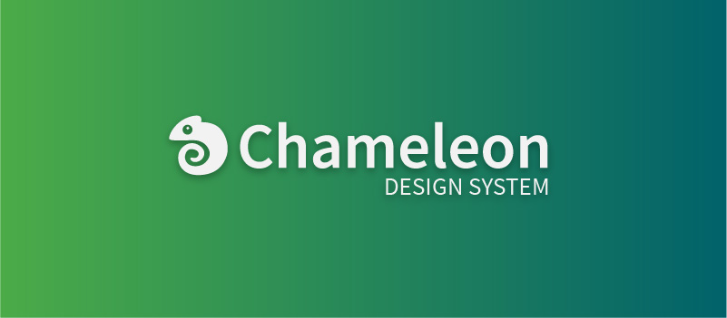

<p align="center">
  
</p>

# Chameleon (Currently In Development)

Chameleon Web Components - A collection of lightweight, unidirectional, framework-agnostic elements based on the Chameleon Design System

## Prerequisites

The Chameleon project relies on some awesome tools in order to work properly. You'll want to have the following installed:

- [Node.js](https://nodejs.org) - JavaScript runtime built on Chrome's V8 JavaScript Engine (this project uses v12.7.0)
- [Git](https://git-scm.com/downloads) - Version control software for cloning this repository
- [NVM (Node Version Manager)](https://github.com/nvm-sh/nvm) - A bash script to manage multiple active node.js versions

## Setup

**Note:** Please ensure you have all the prerequisite software installed before running any of these commands!

To setup Chameleon for development, run the following in your folder of choice:

```bash
git clone git@github.com:MaritzSTL/chameleon.git && cd chameleon && nvm use && npm run setup
```

Chameleon uses storybook for development, so when you're ready to get going just run:

```bash
npm run dev
```

To build each element and package for distribution, run:

```bash
npm run build
```

If something looks wrong or you need to refresh your dependencies for whatever reason you can run:

```bash
npm run clean
```
